# ProjectUAS
## Checklis Toilet

### 1.	Membuat database cheklist
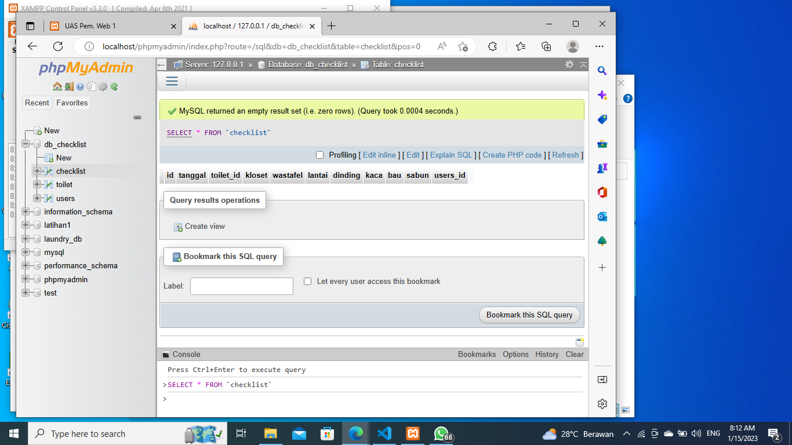

### 2.	Membuat databse toilet
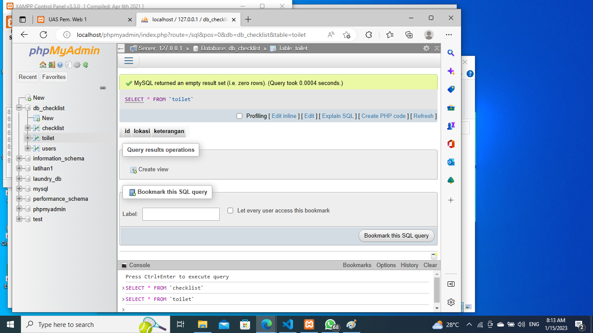

### 3.	Membuat database users
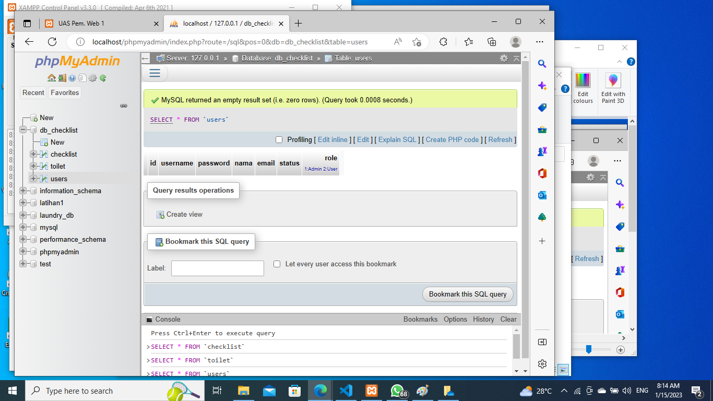

### 4.	Membuat Koneksi.php

### 5.	Membuat Halaman Login
Halaman ini berfungsi sebagai halaman awal saat membuka website ini

### 6.	Membuat login_session.php
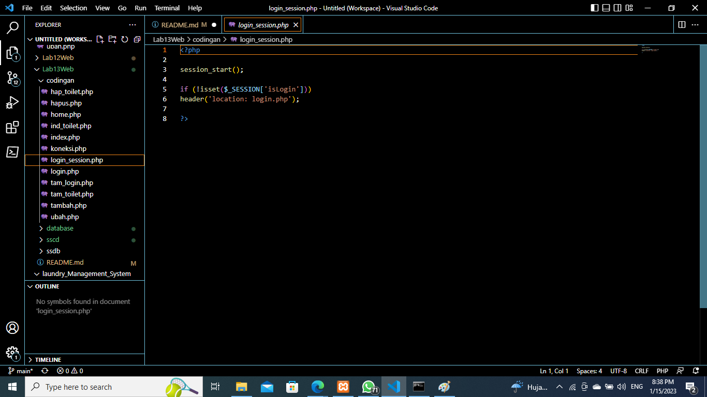

### 8.	Membuat home.php
Membuat file untuk tampilan dasar dari menu awal website ini

### 9.	Membuat index.php
File ini untuk menampilkan data dari databse checklist yang sudah kita input
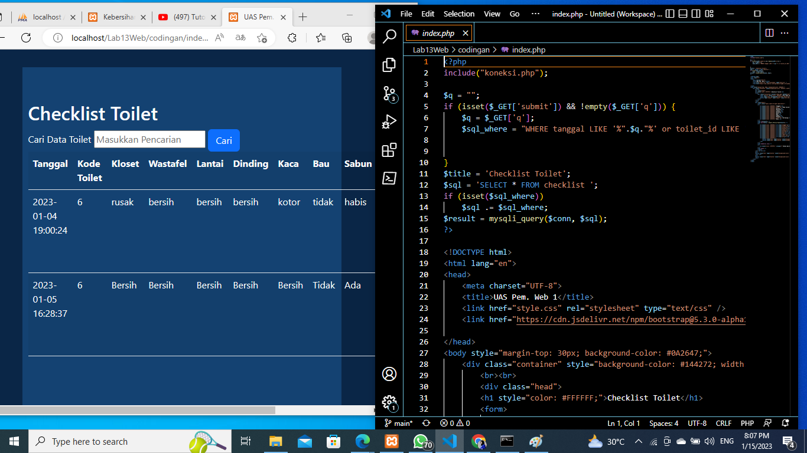

### 10.	Membuat file tambah.php
Berfungsi untuk menambahkan data checklist yg akan diinput
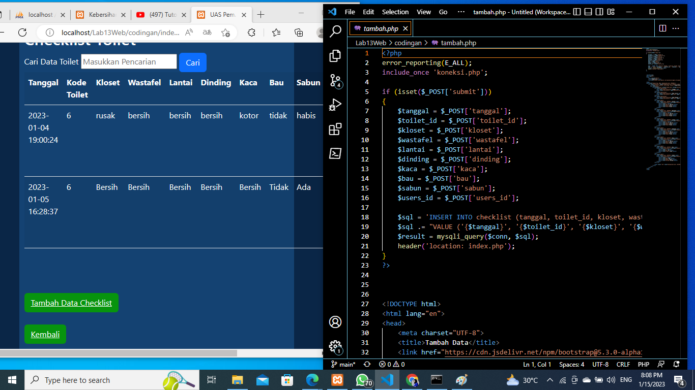

### 11.	Membuat file ubah.php
Membuat file ini untuk mengudah data index checklist
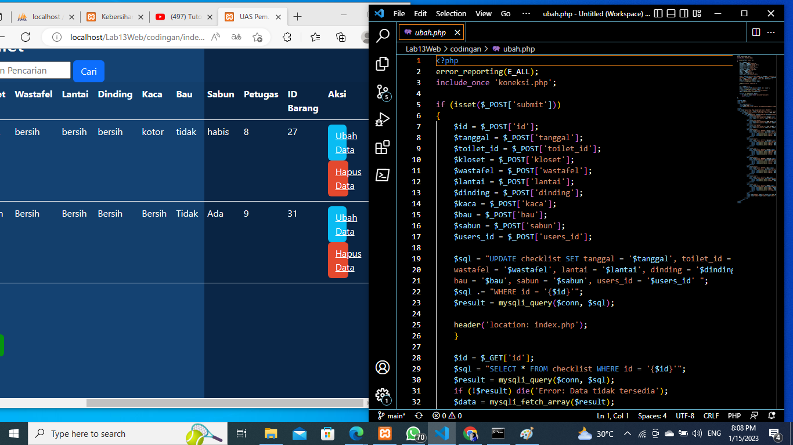

### 12.	Membuat hapus.php
Berfungsi untuk menghapus data yang ingin kita hilangkan dari database checklist
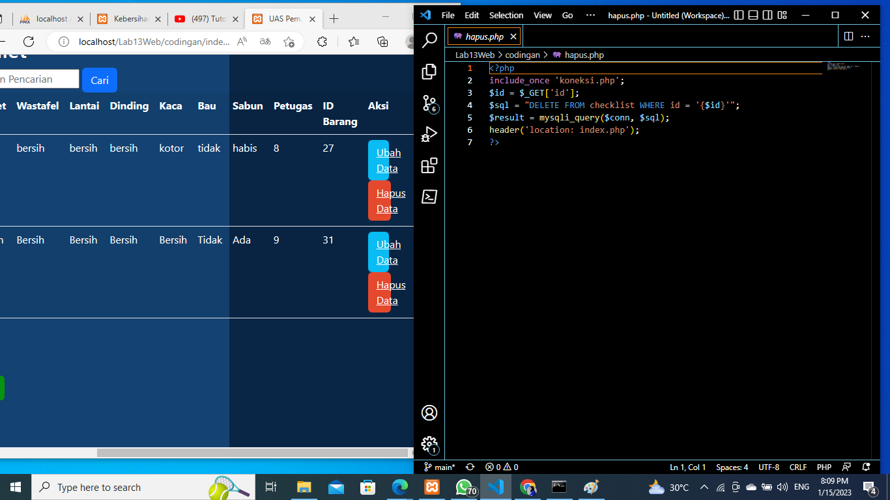

### 13.	Membuat ind_toilet.php
Untuk menampilkan data toilet apa saja yang sudah kita input
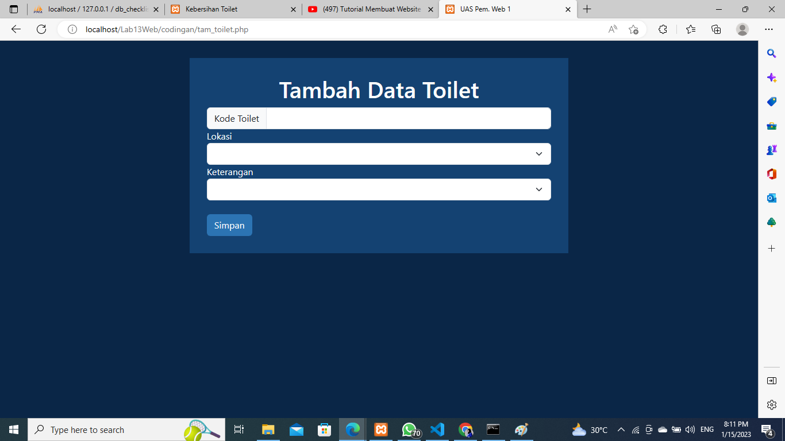

### 14.	Membuat file tam_toilet.php
File ini berfungsi untuk menambahkan data ke databse toilet
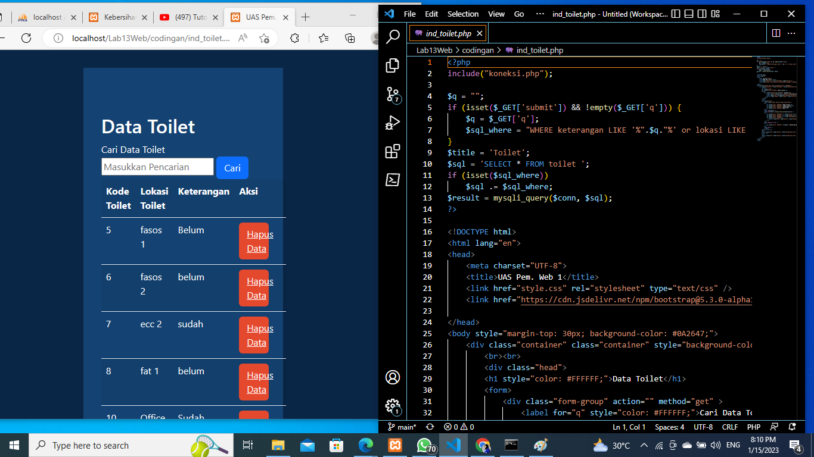

### 15.	Membuat file hap_toilet.php
Tujuannya untuk menghapus data toilet dari database toilet
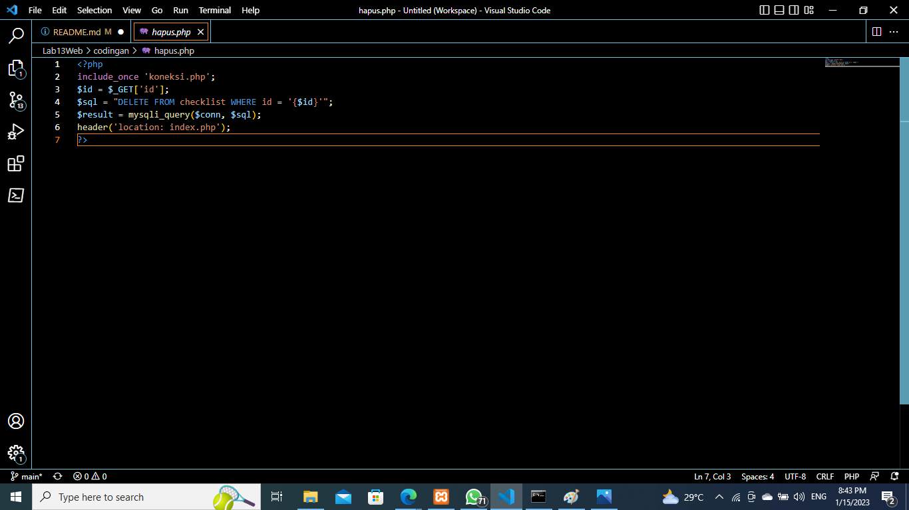

### 16.	Hasil
Inilah hasil dari Project UAS saya, dan Berikut linknya https://youtu.be/hFhhosy5eLU
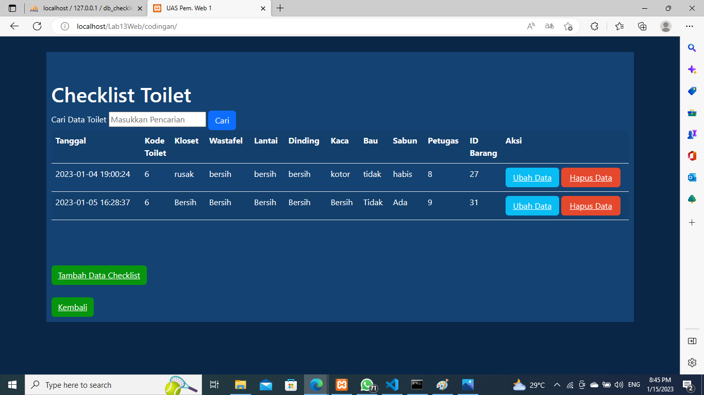

